# Architecture

This document describes the architecture of the Emergency Operations Command Center (EOCC): its layers, the responsibilities of each component, the decision engines, the AI and integration layers, the deployment topology, and the scaling strategy. It is intended for engineers evaluating, operating, or extending the platform.

## Table of Contents

- [Design Principles](#design-principles)
- [System Architecture](#system-architecture)
- [Frontend](#frontend)
- [Backend](#backend)
- [Database](#database)
- [Authentication](#authentication)
- [Authorization and Multi-Tenancy](#authorization-and-multi-tenancy)
- [Decision Engines](#decision-engines)
- [Risk Engine](#risk-engine)
- [Simulation Engine](#simulation-engine)
- [AI Layer](#ai-layer)
- [Integration Layer](#integration-layer)
- [Domain Workflows](#domain-workflows)
- [Deployment Architecture](#deployment-architecture)
- [Scaling Strategy](#scaling-strategy)
- [Observability](#observability)

---

## Design Principles

1. **Explainability over opacity.** Every score and recommendation exposes the factors and weighting that produced it. Engines return a `ScoreResult { score, band, factors, explanation }` rather than a bare number.
2. **Strict layering.** Routers handle HTTP only; services own domain logic and persistence; engines are pure functions. Dependencies point inward and never the other way.
3. **Determinism by default.** Core intelligence is deterministic and reproducible. External AI is an optional enhancement, never a dependency.
4. **Secure by default.** Tenant isolation, permission checks, and audit logging are structural, not optional call sites that can be forgotten.
5. **Portability.** Non-native string enums and standard SQL keep the schema portable across PostgreSQL (production) and SQLite (local development).

---

## System Architecture

EOCC is a layered, service-oriented monolith: a single deployable backend service with clearly separated internal layers, a separate frontend application, and a relational system of record.

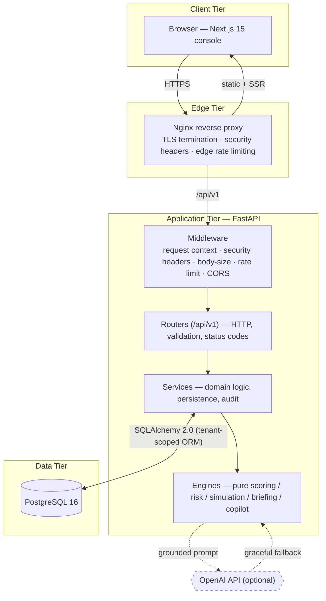

**Layer responsibilities**

| Layer | Responsibility | Must not |
| --- | --- | --- |
| Routers (`app/api/routes`) | Parse/validate requests, enforce permissions, set status codes, shape responses. | Contain business logic or raw SQL. |
| Services (`app/services`) | Domain operations, transactions, audit logging, building the operational snapshot. | Render HTTP concerns. |
| Engines (`app/engines`) | Pure computation of scores, risk, simulations, briefings, copilot answers. | Touch the database or the request context. |
| Models (`app/models`) | ORM entities and enums. | Hold behavior beyond simple properties. |

The single most important boundary is between services and engines: engines consume a precomputed `OperationalSnapshot` (an in-memory aggregate) and return explainable results. Because they never query the database, they are deterministic and trivially unit-testable.

---

## Frontend

The operations console is a Next.js 15 application using the App Router and React 19.

- **Routing.** Public marketing routes live under `app/(marketing)`; the authenticated product lives under `app/app/*` (Mission Control, Incidents, Resources, Hospitals, Shelters, Map, Risk, Alerts, Simulations, Copilot, Briefing, Integration, Security, Audit, Settings). Authentication routes (`/login`, `/register`, `/onboarding`, password reset) sit at the root.
- **Data access.** All server communication goes through a single typed API client (`lib/api.ts`) that injects the bearer token, performs transparent single-flight access-token refresh on `401`, and normalizes errors. Server state is cached and synchronized with TanStack Query (`lib/hooks.ts`).
- **State and identity.** `lib/auth.tsx` holds the authenticated user and the permission set returned by `/auth/me`. Permissions shape the UI (navigation in `lib/nav.ts`, conditional controls) but are never trusted for access control — the server is authoritative.
- **Visualization.** Recharts renders the analytics; React-Leaflet renders the geographic operations map. The map is loaded with SSR disabled and remounted defensively to avoid stale DOM references during development hot-reload.

---

## Backend

The backend is a FastAPI application (`app/main.py`) composed of thin routers aggregated in `app/api/router.py` under the `/api/v1` prefix.

**Middleware stack** (outermost to innermost):

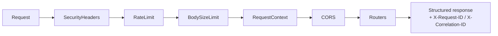

- **RequestContext** assigns an `X-Request-ID`, honors an inbound `X-Correlation-ID`, and captures client IP and user agent into `ContextVars` so every log line and audit record can be correlated.
- **SecurityHeaders** applies CSP, `X-Frame-Options`, `X-Content-Type-Options`, `Referrer-Policy`, `Permissions-Policy`, COOP/CORP, and HSTS (production).
- **RateLimit** is an in-memory fixed-window limiter with a stricter bucket for credential endpoints.
- **BodySizeLimit** rejects oversized requests and uploads before they are buffered.

**Error handling.** Dedicated exception handlers return a uniform JSON envelope `{ error, detail, request_id, correlation_id }`. Stack traces are never returned to clients; unhandled errors are logged server-side and surfaced as a generic `500`.

**Lifespan.** On startup the app registers ORM event listeners (tenant scoping, audit immutability), creates the schema if needed, and optionally seeds demo data.

---

## Database

PostgreSQL 16 is the production system of record; SQLite is supported for zero-infrastructure local development. Access is exclusively through the SQLAlchemy 2.0 ORM (typed `Mapped` columns), so all queries are parameterized.

The schema has **19 entities**. The full ER diagram, per-entity field descriptions, relationships, indexes, and the tenant-isolation strategy are in **[docs/DATABASE.md](docs/DATABASE.md)**. A condensed view:

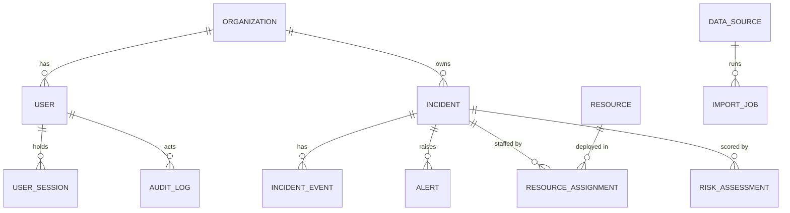

Key data-integrity mechanisms:

- **Optimistic locking** on incidents via a `version` column; conflicting concurrent updates raise instead of silently overwriting.
- **Soft deletes** on critical entities (incidents, data sources) — rows are hidden from reads but retained for forensics.
- **Audit columns** (`created_at`, `updated_at`, `created_by_id`, `updated_by_id`) on every table.
- **Field encryption** (Fernet) for connector secrets and MFA seeds.

---

## Authentication

Authentication uses the OAuth2 password flow with a two-token model: short-lived JWT access tokens and long-lived, rotating, server-side refresh tokens.

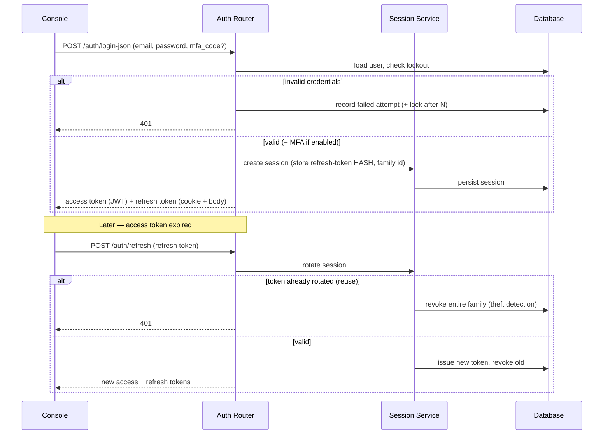

- **Passwords** are hashed with Argon2id; legacy bcrypt hashes are verified and transparently upgraded on next login.
- **Access tokens** are short-lived JWTs carrying `sub`, `role`, `org`, `type`, `jti`, `iat`, `nbf`, `exp`. The `type` claim prevents a refresh token from being used as an access token.
- **Refresh tokens** are opaque random strings; only a keyed HMAC-SHA-256 hash is stored, so a database leak alone cannot reconstruct valid tokens. Rotation with family-reuse detection provides the standard refresh-token-theft defense.
- **MFA** is optional TOTP (RFC 6238) with per-user secrets encrypted at rest.
- **Sessions** are server-side, enabling a device list, per-session revocation, and global logout. Password change/reset and deactivation revoke other sessions.

---

## Authorization and Multi-Tenancy

**Authorization is permission-first.** Endpoints declare the permission they require (for example `Incident.Update`, `Simulation.Run`, `Integration.Configure`, `Audit.View`) via the `require_permission(...)` dependency. Roles map to permission sets in `app/core/permissions.py`:

| Role | Capability summary |
| --- | --- |
| Viewer | Read-only across operational data. |
| Executive | Read + reporting/export + security visibility. |
| Analyst | Read + incident updates, risk/simulation runs, copilot, exports. |
| Emergency Manager | Analyst + operational mutation (manage incidents/lifelines, assign resources, manage alerts, import data). |
| Administrator | All permissions, including user management, integration configuration, and security management. |

**Multi-tenancy is automatic.** Every operational entity carries an `organization_id`. A SQLAlchemy `do_orm_execute` listener (`app/core/tenancy.py`) injects a `WHERE organization_id = <current org>` predicate into every ORM `SELECT`, bound from the authenticated user's organization. Cross-tenant reads are therefore impossible by construction rather than by remembering to filter, and soft-delete predicates are injected the same way. Writes set `organization_id` from the caller's context, so a client cannot assign records to another tenant.

---

## Decision Engines

All engines live in `app/engines/` and are pure functions over the `OperationalSnapshot`. They never perform I/O.

| Engine | File | Output |
| --- | --- | --- |
| Incident Severity | `scoring.py` | 0–100, blends base severity, hazard type, population (log-scaled), footprint, and status. |
| Hospital Stress | `scoring.py` | 0–100, weighted ICU / ER / bed / ventilator load and staffing gap. |
| Shelter Strain | `scoring.py` | 0–100, occupancy plus food/water scarcity. |
| Resource Readiness | `scoring.py` | 0–100, availability, utilization balance, mean readiness. |
| Overall Emergency Health | `scoring.py` | 0–100 composite with status band and an alert penalty. |
| Recommended Actions / SITREP | `recommendations.py` | Prioritized, explainable actions and a narrative situation report. |
| Risk Intelligence | `risk_engine.py` | Five category assessments (see below). |
| Simulation | `simulation_engine.py` | Projected impact and mitigations (see below). |
| Executive Briefing | `briefing.py` | Structured summary and sections. |
| Operations Copilot | `copilot.py` | Grounded answer, suggested actions, citations. |

### Scoring model (summary)

| Score | Inputs | Weighting |
| --- | --- | --- |
| Incident Severity | base severity, hazard type, population (log), footprint, status | severity 45 / population 30 / footprint 25, × type weight × status multiplier |
| Hospital Stress | ICU, ER, bed, ventilator loads, staffing gap | ICU 32 / ER 28 / bed 18 / ventilator 12 / staffing 10 |
| Shelter Strain | occupancy, food/water scarcity | occupancy 70 / food 15 / water 15 |
| Resource Readiness | availability, utilization balance, mean readiness | availability 45 / readiness 40 / balance 15 |
| Overall Health | inverted incident/hospital/shelter strain + readiness − alert penalty | 30 / 25 / 20 / 25, − up to 20 |

---

## Risk Engine

`risk_engine.py` produces explainable assessments across five categories: **population, infrastructure, healthcare, resource, environmental**. Each assessment carries a 0–100 score, a severity band (`low` → `critical`), the contributing factors, a plain-language explanation, and recommended actions. Because scoring is deterministic, regenerating the assessment over the same snapshot yields the same result, which is essential for auditability.

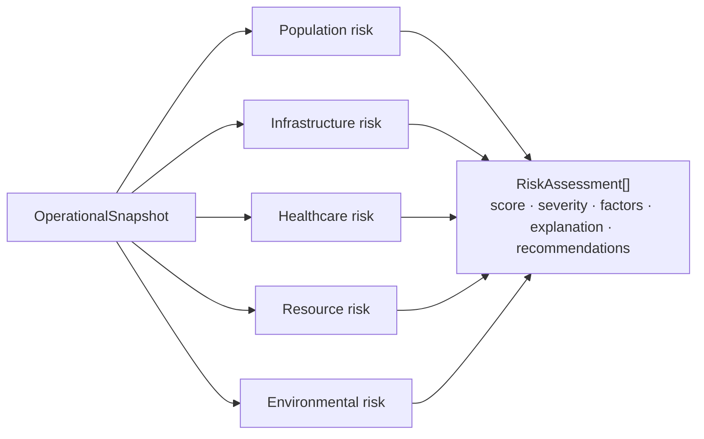

---

## Simulation Engine

`simulation_engine.py` models six scenario types: hurricane track shift, flood expansion, shelter closure, hospital outage, resource depletion, and utility-grid failure. Each run takes scenario parameters, projects the operational consequences against the current snapshot, and returns mitigation recommendations and an operational-risk score. Runs are persisted as `Simulation` records for later review.

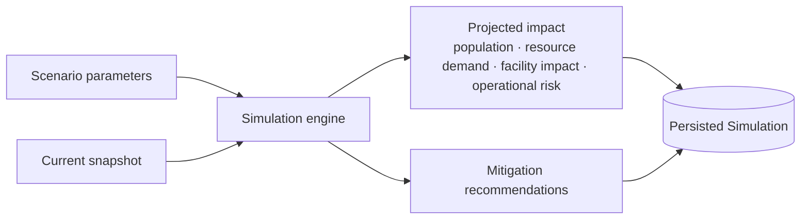

---

## AI Layer

The Operations Copilot has two interchangeable backends behind one interface:

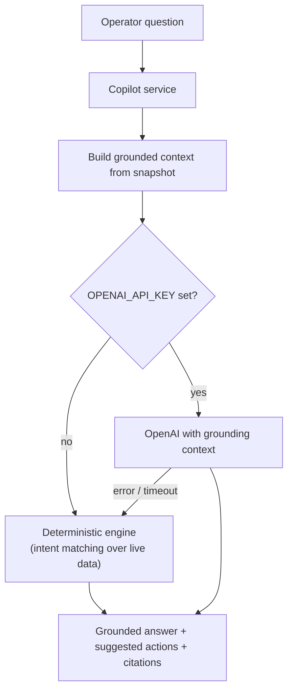

The deterministic engine resolves intent via transparent keyword matching and answers from the live operational snapshot, so the copilot is always available and never fabricates data outside the current operating picture. When OpenAI is configured, the same snapshot is passed as grounding context; any failure falls back to the deterministic path. Responses are persisted as `AIReport` records with the engine that produced them.

---

## Integration Layer

Connected Mode brings external data into the platform through a connector registry and file imports, monitored by a pipeline view.

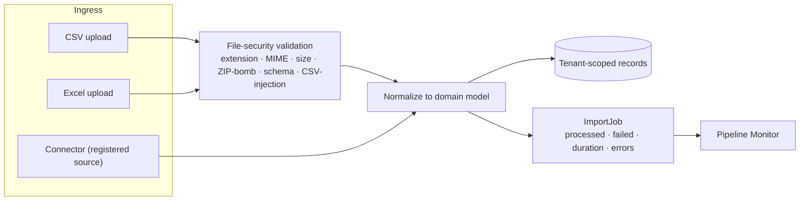

Imported records carry a `data_origin` so the console can distinguish demo, manual, and connected data (data provenance). Connector credentials are encrypted at rest and never serialized back to clients.

---

## Domain Workflows

### Incident lifecycle

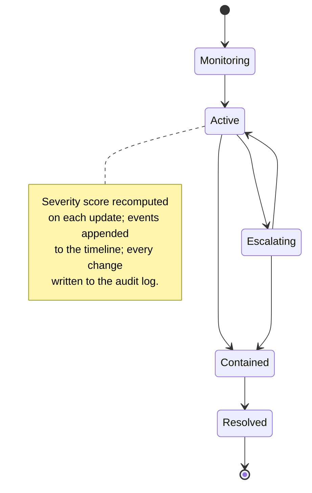

### Mission Control request

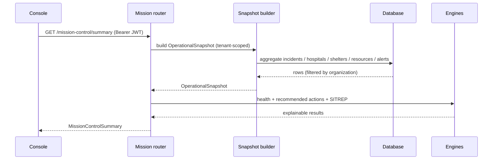

---

## Deployment Architecture

The reference deployment is a hardened Docker Compose stack with explicit tier separation.

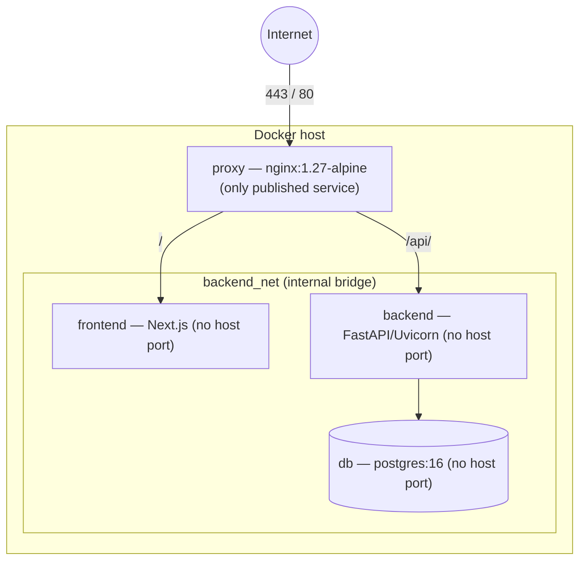

Hardening applied in `docker-compose.yml` and `deploy/nginx.conf`:

- Only the proxy publishes a port; the database has no host port and is reachable only on the internal network.
- Application containers run with `no-new-privileges`, read-only root filesystems, and `tmpfs` for scratch space.
- The proxy terminates TLS (in production), applies security headers, and enforces an independent edge rate limit (stricter on auth paths).

Full production guidance — environment, scaling, monitoring, logging, and backups — is in **[docs/DEPLOYMENT.md](docs/DEPLOYMENT.md)**.

---

## Scaling Strategy

EOCC is designed to scale horizontally at the application tier:

- **Stateless application tier.** The backend keeps no per-instance session state in the database path — sessions are stored in PostgreSQL — so backend containers can scale horizontally behind the proxy/load balancer.
- **Externalize in-process state.** Rate limiting and metrics are in-process by default; for multi-instance deployments move rate limiting to a shared store (Redis) and scrape metrics into a central backend (Prometheus).
- **Database.** Scale reads with replicas and connection pooling; the tenant-scoped query pattern and per-tenant indexes keep query plans predictable as data grows. Partitioning high-volume append-only tables (audit logs, login attempts, incident events) by time is the documented next step.
- **Stateless engines.** Because engines are pure functions, heavy scoring/simulation work can be parallelized or offloaded to workers without shared-state concerns.
- **AI tier.** The optional OpenAI path is isolated behind the copilot interface with a deterministic fallback, so AI latency or outages never degrade core operations.

---

## Observability

- **Structured logs** with a dedicated security logger for security-category events. Secrets and tokens are never logged.
- **Correlation.** `X-Request-ID` and `X-Correlation-ID` propagate through logs and audit records via `ContextVars`.
- **Probes.** `/health` (liveness summary), `/live`, `/ready` (verifies database connectivity), and `/metrics` (Prometheus text exposition with request, error, and auth-failure counters).
- **Audit trail.** An immutable, append-only audit log records every mutating action with actor, organization, IP, user agent, old/new values, and correlation id — usable both for compliance and for incident investigation.
