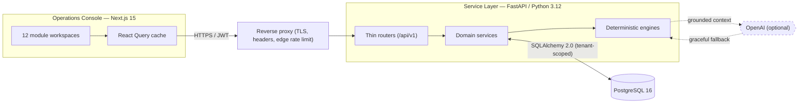
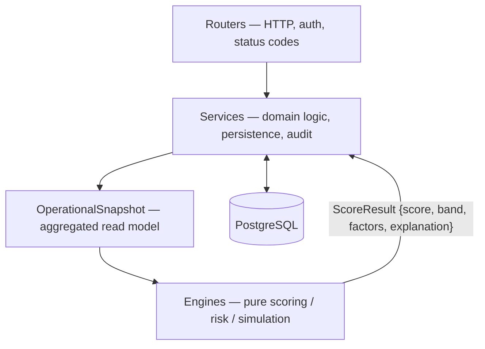
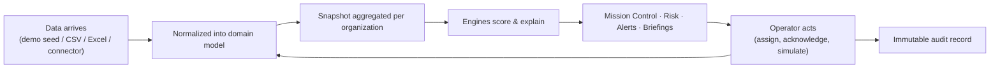

<div align="center">

# Emergency Operations Command Center

**An operational intelligence platform that turns fragmented emergency data into coordinated, explainable decisions.**

[](LICENSE)
[](https://github.com/arydub-dev/EOCC/actions/workflows/ci.yml)
[](https://github.com/arydub-dev/EOCC/actions/workflows/security.yml)
[](https://github.com/arydub-dev/EOCC/releases)
[](backend)
[](frontend)
[](docker-compose.yml)
[](docs)

[Quick Start](#installation) · [Architecture](ARCHITECTURE.md) · [Security](SECURITY.md) · [API](docs/API.md) · [Deployment](docs/DEPLOYMENT.md) · [Contributing](CONTRIBUTING.md)

</div>

---

## Executive Summary

The Emergency Operations Command Center (EOCC) is a decision-support platform for organizations that coordinate response during crises — emergency-management agencies, governments, hospital networks, utilities, and humanitarian organizations.

EOCC is not a dashboard, a CRUD application, or a disaster tracker. It is an operational environment built to answer three questions continuously, and with explainable reasoning:

1. **What is happening?**
2. **Why is it happening?**
3. **What should we do next?**

Every capability in the platform maps to one or more of those questions. Scores, recommendations, and risk assessments are produced by deterministic engines that always expose the factors and weighting behind their output, so operators can trust — and defend — the decisions the platform supports.

The platform ships with a self-seeding demo workspace so a new operator or evaluator can see a realistic, fully populated operating picture within minutes, and a connected mode for ingesting real operational data.

---

## Problem Statement

During an emergency, the information required to make good decisions is real, but it is scattered. Incident feeds, geographic information systems, hospital capacity systems, resource registries, weather services, call centers, and ad-hoc spreadsheets each hold part of the picture and none hold all of it.

The result is a predictable set of failures under pressure:

- Leaders cannot form a single, current understanding of conditions.
- Resource allocation is reactive rather than prioritized.
- Capacity bottlenecks (hospital, shelter, supply) are discovered late.
- Coordination depends on individuals manually reconciling systems.
- Decisions are difficult to explain, audit, or reproduce after the fact.

EOCC exists to consolidate that fragmented information into one operating picture and to make the reasoning behind every recommendation transparent.

---

## Operational Challenges

| Challenge | How EOCC addresses it |
| --- | --- |
| **Fragmented data** | A normalized domain model and an integration layer (CSV/Excel import + connector registry) bring incidents, lifelines, and assets into one schema. |
| **Situational awareness** | Mission Control composes a live operational snapshot into a single health score, headline metrics, critical alerts, and a generated situation report. |
| **Prioritization** | Deterministic scoring engines rank incidents, hospital stress, shelter strain, and resource readiness on a comparable 0–100 scale. |
| **Anticipation** | The Simulation Center models what-if scenarios (hurricane track shifts, flood expansion, outages, depletion) and projects operational impact. |
| **Explainability** | Every score returns its weighted factors and a plain-language explanation; every mutating action is recorded in an immutable audit log. |
| **Trust and governance** | Permission-first RBAC, multi-tenant isolation, and a Security Center give operators control and visibility over who did what. |

---

## Platform Overview

EOCC is a full-stack platform composed of a FastAPI service layer, a Next.js operations console, and a PostgreSQL system of record, deployed behind a single hardened reverse proxy.



The platform operates in two modes:

- **Demo Mode (default).** The database self-seeds with synthetic but realistic incidents, hospitals, shelters, resources, utility outages, and alerts, so the system is fully operational on first boot.
- **Connected Mode.** Operators register data sources and import CSV/Excel data through the Integration Framework. Imported records become first-class platform data and flow through the same engines as demo data.

---

## Core Capabilities

### Mission Control
The primary operating picture. Composes a live `OperationalSnapshot` into an overall Emergency Health score, headline metrics (active incidents, population impacted, hospital and shelter capacity, resource availability), the highest-severity open alerts, prioritized recommended actions, and an auto-generated situation report.

### Incident Management
Tracks wildfires, floods, hurricanes, earthquakes, industrial accidents, disease outbreaks, infrastructure failures, and severe storms. Each incident carries location, severity, footprint, status, impacted population, an event timeline, and a computed severity score. Updates use optimistic concurrency control so simultaneous edits cannot silently overwrite one another.

### Resource Coordination
Manages ambulances, fire apparatus, medical and rescue teams, helicopters, and supply stocks (food, water, fuel, generators). Provides availability and utilization analytics and an assignment workflow that ties resources to incidents with full audit history.

### Hospital Operations
Tracks bed, ICU, emergency-department, ventilator, and staffing levels, and computes a weighted Hospital Stress score that surfaces facilities at risk before they reach crisis.

### Shelter Operations
Tracks occupancy against capacity and food/water/medical supply buffers, and computes a Shelter Strain score that highlights overcrowding and supply-shortage risk.

### Risk Intelligence
Generates explainable risk assessments across five categories — population, infrastructure, healthcare, resource, and environmental — each with a score, severity band, explanation, and recommendations.

### Simulation Center
Models six what-if scenario types (hurricane track shift, flood expansion, shelter closure, hospital outage, resource depletion, utility-grid failure) and projects affected population, additional resource demand, facility impact, and operational risk, with mitigation recommendations.

### Operations Copilot
Answers operational questions grounded in the live operational snapshot ("which hospitals are under the most stress?", "where should additional resources go?"). Uses OpenAI when configured and falls back to a deterministic, fully local engine when it is not — the platform never depends on an external AI service to remain functional.

### Executive Briefings
Generates a structured executive summary — current situation, resource status, emerging risks, recommended actions — exportable as Markdown for distribution.

### Integration Framework
A connector registry, CSV/Excel import with schema validation, and a pipeline monitor reporting records processed, failures, sync duration, and connector health. Connector credentials are encrypted at rest.

---

## System Architecture

EOCC follows a layered architecture with a strict dependency direction: routers handle HTTP concerns only, services own domain logic, and engines are pure functions over a computed snapshot. Engines never touch the database, which keeps them deterministic and independently testable.



A full treatment — frontend, backend, database, authentication, the risk and simulation engines, the AI layer, the integration layer, deployment topology, and the scaling strategy — is in **[ARCHITECTURE.md](ARCHITECTURE.md)**.

### Technology Stack

| Layer | Technology |
| --- | --- |
| Operations console | Next.js 15 (App Router), TypeScript, React 19, Tailwind CSS, TanStack Query, Recharts, React-Leaflet |
| Service layer | FastAPI, Python 3.12, SQLAlchemy 2.0, Pydantic v2, Uvicorn |
| System of record | PostgreSQL 16 (SQLite supported for zero-infrastructure local development) |
| Authentication | OAuth2 password flow, JWT access tokens, rotating server-side refresh tokens, optional TOTP MFA |
| Authorization | Permission-first RBAC across five roles |
| AI | OpenAI (optional) with a deterministic local fallback engine |
| Packaging & deployment | Docker, Docker Compose, Nginx reverse proxy |

### Operational Workflows



---

## Screenshots

Screenshots and a repeatable capture plan live in **[docs/SCREENSHOTS.md](docs/SCREENSHOTS.md)**. Image assets are stored under [`assets/`](assets). Sign in with the demo administrator account (below) to reproduce them locally.

---

## Installation

EOCC is designed so a new developer can clone, configure, run, seed demo data, and reach the application in roughly fifteen minutes. Docker is the recommended path.

### Docker Deployment

```bash
git clone https://github.com/arydub-dev/EOCC.git && cd EOCC
cp .env.example .env

# Set the required secrets in .env before starting (see Configuration below):
#   SECRET_KEY            -> openssl rand -hex 32
#   ENCRYPTION_KEY        -> python -c "from cryptography.fernet import Fernet; print(Fernet.generate_key().decode())"
#   POSTGRES_PASSWORD     -> openssl rand -base64 24

docker compose up --build
```

Once the stack is healthy:

| Service | URL |
| --- | --- |
| Operations console (via proxy) | http://localhost |
| API (Swagger UI) | http://localhost/api/v1 → see `/docs` on the backend |
| Health probe | http://localhost/api/v1/../health |

> When running the backend directly (without the proxy), the API documentation is served at `http://localhost:8000/docs` (Swagger) and `http://localhost:8000/redoc` (ReDoc), and health probes at `/health`, `/live`, `/ready`, and `/metrics`.

The backend creates the schema and seeds synthetic demo data on first boot, so the platform is populated immediately.

### Configuration

Configuration is supplied entirely through environment variables (12-factor). In production (`ENVIRONMENT=production`) the service **fails closed**: it refuses to start with a default or weak `SECRET_KEY` or a missing `ENCRYPTION_KEY`.

#### Environment Variables

| Variable | Default | Purpose |
| --- | --- | --- |
| `ENVIRONMENT` | `development` | `production` enables fail-closed secret validation and HSTS. |
| `DATABASE_URL` | `sqlite:///./eocc.db` | SQLAlchemy URL. Use PostgreSQL in production. |
| `SECRET_KEY` | *(insecure dev default)* | Signs JWT access tokens. Required (≥32 chars) in production. |
| `REFRESH_TOKEN_SECRET` | *(derived)* | Keyed HMAC for refresh tokens. Derived from `SECRET_KEY` if unset. |
| `ENCRYPTION_KEY` | *(derived in dev)* | Fernet key for field encryption. Required in production. |
| `ACCESS_TOKEN_EXPIRE_MINUTES` | `15` | Access-token lifetime. |
| `REFRESH_TOKEN_EXPIRE_DAYS` | `14` | Refresh-token lifetime (`REMEMBER_ME_EXPIRE_DAYS` = 30). |
| `COOKIE_SECURE` / `COOKIE_SAMESITE` | `false` / `lax` | Refresh-cookie attributes. Set `COOKIE_SECURE=true` behind TLS. |
| `PASSWORD_MIN_LENGTH` + `PASSWORD_REQUIRE_*` | `12` + all true | Password policy. |
| `MAX_FAILED_LOGINS` / `LOCKOUT_MINUTES` | `5` / `15` | Account lockout thresholds. |
| `RATE_LIMIT_*` | `300` / `20` per min | Default and auth-endpoint rate limits. |
| `MAX_REQUEST_BYTES` / `MAX_UPLOAD_BYTES` / `MAX_IMPORT_ROWS` | `2MB` / `10MB` / `50000` | Request, upload, and import caps. |
| `BACKEND_CORS_ORIGINS` | `localhost` origins | Comma-separated allowed origins. |
| `SEED_ON_STARTUP` + `SEED_*` | `true` + demo counts | Demo seeding toggle and volumes. |
| `OPENAI_API_KEY` / `OPENAI_MODEL` | *(empty)* / `gpt-4o-mini` | Enables the OpenAI copilot path; empty uses the local engine. |
| `NEXT_PUBLIC_API_BASE_URL` | `/api/v1` | API base the console calls (same-origin behind the proxy). |

The complete, annotated reference is in [`.env.example`](.env.example).

### Running Locally

For development without Docker, run the two services directly. SQLite requires no external database.

**Service layer (FastAPI):**

```bash
cd backend
python3.12 -m venv .venv && source .venv/bin/activate
pip install -r requirements.txt
export DATABASE_URL="sqlite:///./eocc.db"
uvicorn app.main:app --reload --port 8000
```

**Operations console (Next.js):**

```bash
cd frontend
npm install
export NEXT_PUBLIC_API_BASE_URL="http://localhost:8000/api/v1"
npm run dev   # http://localhost:3000
```

A convenience bootstrap script is provided at [`scripts/dev.sh`](scripts/dev.sh).

### Demo Workspace

Demo accounts are seeded for local evaluation only. **They are demonstration credentials — disable or rotate them before any non-local deployment.**

| Role | Email | Password |
| --- | --- | --- |
| Administrator | `admin@eocc.gov` | `admin123` |
| Emergency Manager | `manager@eocc.gov` | `manager123` |
| Analyst | `analyst@eocc.gov` | `analyst123` |
| Executive | `exec@eocc.gov` | `exec123` |

### Enterprise Deployment

The bundled `docker-compose.yml` separates tiers: only the reverse proxy is published, the database has no host port and lives on an internal network, and the application containers run as non-root with read-only root filesystems and `no-new-privileges`. For production sizing, scaling, monitoring, logging, and backup guidance, see **[docs/DEPLOYMENT.md](docs/DEPLOYMENT.md)**.

---

## Security

Security is treated as a core architectural property, following Zero Trust, Least Privilege, Defense in Depth, and Secure-by-Default principles. Highlights:

- **Authentication** — Argon2id password hashing (legacy bcrypt transparently upgraded), configurable password policy, account lockout, short-lived JWT access tokens, and rotating server-side refresh tokens with reuse/theft detection. Optional TOTP MFA.
- **Authorization** — permission-first RBAC enforced exclusively on the server; the console never makes access decisions.
- **Multi-tenancy** — every ORM read is automatically scoped to the caller's organization, making cross-tenant access impossible by default.
- **API hardening** — request/correlation IDs, strict security headers, rate limiting (stricter on credential endpoints), request-size and pagination caps, and structured errors that never leak stack traces.
- **Data protection** — Fernet field encryption for connector secrets and MFA seeds, parameterized queries, soft deletes, optimistic locking, and `created_by`/`updated_by` stamps.
- **Auditability** — an immutable, append-only audit log with old/new values and correlation IDs, surfaced in an Audit Center with CSV export, plus a Security Center with an organization security posture score.

The full security architecture, assumptions, known limitations, and the responsible-disclosure process are documented in **[SECURITY.md](SECURITY.md)**.

---

## Roadmap

Planned work is tracked in **[ROADMAP.md](ROADMAP.md)**. In summary:

- **v1.1** — performance improvements, additional integrations, richer simulations.
- **v1.2** — workflow automation, live weather feeds, incident forecasting.
- **v2.0** — multi-region deployment, AI investigation agents, advanced GIS analytics, offline operations.

---

## Project Structure

```
EOCC/
├── backend/          FastAPI service layer (routers, services, engines, models, seed)
├── frontend/         Next.js operations console + public marketing site
├── deploy/           Reverse-proxy (Nginx) configuration
├── docs/             Architecture, API, database, deployment, and security references
├── scripts/          Developer bootstrap and maintenance scripts
├── assets/           Screenshots and brand assets
├── .github/          CI/CD workflows, issue and pull-request templates
├── docker-compose.yml
├── .env.example
├── ARCHITECTURE.md   System architecture and design decisions
├── SECURITY.md       Security architecture and disclosure policy
├── CONTRIBUTING.md   Development workflow and standards
├── ROADMAP.md        Release roadmap
└── CHANGELOG.md      Versioned change history
```

A folder-by-folder and module-by-module breakdown is in **[docs/PROJECT_STRUCTURE.md](docs/PROJECT_STRUCTURE.md)**.

---

## Documentation

| Document | Contents |
| --- | --- |
| [ARCHITECTURE.md](ARCHITECTURE.md) | System architecture, layers, engines, AI layer, deployment, scaling. |
| [SECURITY.md](SECURITY.md) | Authentication, authorization, tenancy, audit, disclosure policy. |
| [docs/API.md](docs/API.md) | Authentication, endpoints, request/response formats, errors, pagination, versioning. |
| [docs/DATABASE.md](docs/DATABASE.md) | ER diagram, entity descriptions, relationships, indexes, tenant isolation. |
| [docs/DEPLOYMENT.md](docs/DEPLOYMENT.md) | Docker Compose, production deployment, scaling, monitoring, logging, backups. |
| [docs/PROJECT_STRUCTURE.md](docs/PROJECT_STRUCTURE.md) | Folder and module reference. |
| [CONTRIBUTING.md](CONTRIBUTING.md) | Setup, coding standards, branch/commit conventions, PR workflow, testing. |

---

## API

The API is versioned under `/api/v1` and fully described by an OpenAPI schema served at `/api/v1/openapi.json`, with interactive Swagger UI at `/docs` and ReDoc at `/redoc`. Authentication uses an `Authorization: Bearer <access_token>` header; tokens are obtained from `/api/v1/auth/login-json`. List endpoints share a consistent pagination, filtering, search, and sort contract. See **[docs/API.md](docs/API.md)** for the full reference.

---

## Contributing

Contributions are welcome. Please read **[CONTRIBUTING.md](CONTRIBUTING.md)** for the development setup, coding standards, branch-naming and commit conventions, the pull-request workflow, and testing and documentation expectations, and **[CODE_OF_CONDUCT.md](CODE_OF_CONDUCT.md)** for community standards. Security issues must follow the private disclosure process in [SECURITY.md](SECURITY.md) rather than being filed as public issues.

---

## License

EOCC is released under the **Apache License 2.0** — see [LICENSE](LICENSE). Apache 2.0 was selected for its broad enterprise adoption, permissive terms, and explicit patent and trademark provisions, which give organizations clear legal footing to adopt, extend, and deploy the platform. The rationale is expanded in [CONTRIBUTING.md](CONTRIBUTING.md#license-and-contributions).

---

## Closing Thoughts

EOCC is built on a simple conviction: under pressure, the value of an operations platform is measured by the quality of the decisions it enables and the degree to which those decisions can be trusted, explained, and audited. The emphasis throughout the codebase — deterministic and explainable engines, strict layering, permission-first authorization, tenant isolation, and an immutable audit trail — reflects that conviction. The goal is not to replace the judgment of emergency professionals, but to give them a single, reliable, and defensible operating picture when it matters most.
