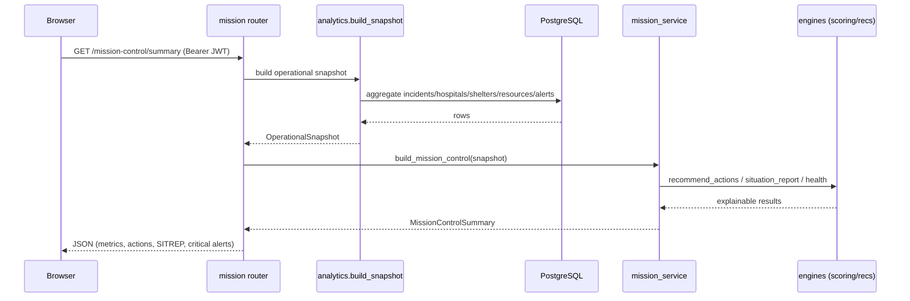
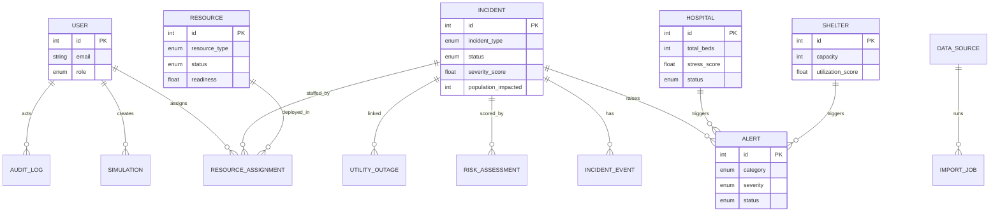
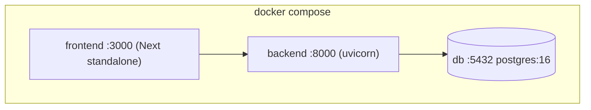

# EOCC — System Architecture

## 1. High-level architecture

```mermaid
flowchart LR
  subgraph Client["Browser — Next.js 15 (App Router)"]
    UI[12 Module UIs]
    RQ[React Query cache]
    UI --> RQ
  end

  subgraph API["FastAPI (Python 3.12)"]
    R[Thin Routers]
    S[Service Layer]
    E[Decision Engines]
    R --> S --> E
  end

  DB[(PostgreSQL 16)]
  OAI{{OpenAI API\n(optional)}}

  RQ -->|JWT / REST| R
  S <-->|SQLAlchemy 2.0| DB
  E -. grounded context .-> OAI
  OAI -. fallback .-> E

  classDef opt stroke-dasharray: 5 5;
  class OAI opt;
```

**Design principle:** routers are thin and only handle HTTP concerns (validation, auth,
status codes). All logic lives in the **service layer**, which composes **pure decision
engines**. The engines never touch the database — they consume a computed
`OperationalSnapshot`, which keeps them deterministic and unit-testable.

## 2. Request lifecycle (e.g. Mission Control)



## 3. Data model (ER overview)



### Full entity list (16)

`User`, `Incident`, `IncidentEvent`, `Hospital`, `Shelter`, `Resource`,
`ResourceAssignment`, `UtilityOutage`, `RiskAssessment`, `Alert`, `Simulation`,
`AIReport`, `DataSource`, `ImportJob`, `AuditLog`, `AppSetting`.

## 4. Scoring model (summary)

| Score | Inputs | Weighting |
| --- | --- | --- |
| Incident Severity | base severity, hazard type, population (log), footprint, status | severity 45 / pop 30 / footprint 25, × type weight × status multiplier |
| Hospital Stress | ICU, ER, bed, ventilator loads, staffing gap | ICU 32 / ER 28 / bed 18 / vent 12 / staffing 10 |
| Shelter Strain | occupancy, food/water scarcity | occupancy 70 / food 15 / water 15 |
| Resource Readiness | availability, utilization balance, mean readiness | availability 45 / readiness 40 / balance 15 |
| Overall Health | inverted incident/hospital/shelter strain + readiness − alert penalty | 30 / 25 / 20 / 25, − up to 20 |

Every engine returns a `ScoreResult { score, band, factors, explanation }` so the UI and
audit trail can always show *why* a number is what it is.

## 5. Security & governance

- **JWT** bearer tokens (OAuth2 password flow); bcrypt-hashed passwords.
- **RBAC** via `require_roles(...)` dependency factory; Admin supersedes all roles.
- **Audit logging** on every mutating action (`audit_service.log`).
- **Global error handling** returns sanitized 500s; validation handled by Pydantic v2.
- **Pagination / filtering / search / sorting** standardized via `PaginationParams` +
  `services/common.paginate`.

## 6. Deployment topology


