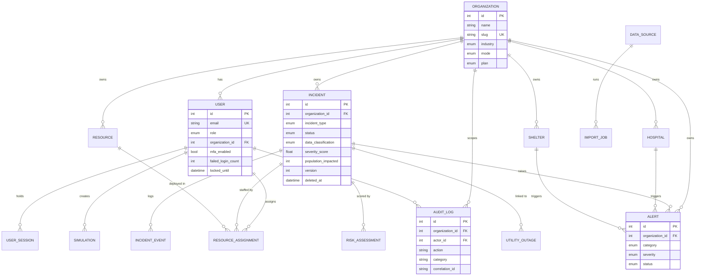

# Database

EOCC uses PostgreSQL 16 in production and supports SQLite for zero-infrastructure local development. All access is through the SQLAlchemy 2.0 ORM with typed `Mapped` columns, so every query is parameterized and the schema stays portable (enums are stored as non-native strings).

The schema contains **19 entities**.

## Entity-Relationship Diagram

## Entities

### Tenancy & identity

| Entity | Table | Purpose |
| --- | --- | --- |
| Organization | `organizations` | Top-level tenant. Carries industry, workspace mode (demo/connected), plan, and provisioning state. Every operational entity belongs to one. |
| User | `users` | Account with role, credentials (Argon2id hash), lockout counters, and MFA state. Belongs to an organization. |
| UserSession | `user_sessions` | Server-side refresh-token session. Stores only the token *hash*, a rotation `family_id`, expiry, last-used, IP, user agent, and device label. |
| LoginAttempt | `login_attempts` | Append-only record of authentication attempts (email, success, reason, IP) for lockout and the Security Center. |

### Operational core

| Entity | Table | Purpose |
| --- | --- | --- |
| Incident | `incidents` | A hazard event with location, footprint, severity, status, impacted population, classification, optimistic-lock `version`, and soft-delete `deleted_at`. |
| IncidentEvent | `incident_events` | Timeline entries for an incident (type, description, severity delta, timestamp, payload). |
| Hospital | `hospitals` | Facility capacity: beds, ICU, ED, ventilators, staffing, computed stress score, diversion flag. |
| Shelter | `shelters` | Mass-care capacity: occupancy, food/water/medical supplies, computed utilization score. |
| Resource | `resources` | Deployable asset (vehicles, teams, supplies) with location, capacity, availability, and readiness. |
| ResourceAssignment | `resource_assignments` | Links a resource to an incident, with quantity, role, assignment/release timestamps, and assigning user. |
| UtilityOutage | `utility_outages` | Lifeline outage (power/water/gas/telecom/internet) with affected customers and restoration estimate. |

### Intelligence & reporting

| Entity | Table | Purpose |
| --- | --- | --- |
| RiskAssessment | `risk_assessments` | Generated risk by category, with score, severity, explanation, factors, and recommendations. |
| Alert | `alerts` | Lifecycle alert (open → acknowledged → resolved) with category, severity, links to incident/hospital/shelter, and response actions. |
| Simulation | `simulations` | A what-if run: type, parameters, results, recommendations, operational-risk score, and creator. |
| AIReport | `ai_reports` | Persisted copilot/briefing output with prompt, content, structured data, grounding, and the engine used. |

### Integration & governance

| Entity | Table | Purpose |
| --- | --- | --- |
| DataSource | `data_sources` | Registered connector with type, status, endpoint, encrypted credentials (`secret_encrypted`), sync cadence, health, and soft-delete. |
| ImportJob | `import_jobs` | Record of a CSV/Excel/connector import: target entity, counts (total/processed/failed), duration, and errors. |
| AuditLog | `audit_logs` | Immutable, append-only action record: actor, organization, action, category, entity, old/new values, IP, user agent, correlation id. |
| AppSetting | `app_settings` | Key/value application settings. |

## Relationships

- An **Organization** owns all tenant-scoped entities via `organization_id`.
- A **User** belongs to an Organization and owns sessions; users author assignments, simulations, and audit records.
- An **Incident** aggregates events, alerts, resource assignments, and risk assessments, and may link utility outages.
- A **Resource** participates in many assignments over time; only one active assignment per resource is expected.
- A **DataSource** produces many ImportJobs.

Foreign keys use `ON DELETE CASCADE` for owned children (e.g. incident events) and `ON DELETE SET NULL` for soft references (e.g. an alert's incident), preserving history when a parent is removed.

## Indexes

Indexes are defined for the access patterns the platform actually uses:

- **Tenant scoping:** `organization_id` is indexed on every tenant-scoped table, because it is part of nearly every query's `WHERE` clause.
- **Identity & lookup:** unique indexes on `users.email` and `organizations.slug`; indexed `user_sessions.refresh_token_hash`, `family_id`, and `expires_at`.
- **Filtering & sorting:** indexed status/type/severity columns (e.g. `incidents.status`, `incidents.incident_type`, `alerts.severity`, `alerts.status`), `region` columns, and time columns used for ordering (`alerts.triggered_at`, `incident_events.occurred_at`).
- **Audit & forensics:** indexed `audit_logs.action`, `category`, `entity_type`, `correlation_id`, and `actor_id`; indexed `login_attempts.email` and `successful`.

For large deployments, the recommended next step is composite per-tenant indexes on hot filter/sort pairs (e.g. `(organization_id, status, triggered_at)`) and time-based partitioning of the append-only tables (`audit_logs`, `login_attempts`, `incident_events`).

## Tenant Isolation Strategy

Isolation is enforced at the ORM layer, not left to individual queries:

1. Every tenant-scoped model carries an indexed `organization_id`.
2. A SQLAlchemy `do_orm_execute` event listener (`app/core/tenancy.py`) injects `WHERE organization_id = :current_org` into **every** `SELECT`, using the organization bound to the authenticated request. The same mechanism injects `deleted_at IS NULL` for soft-deletable entities.
3. Writes set `organization_id` from the authenticated context, so a client cannot create or move a record into another tenant.
4. The few queries that operate outside the auto-filtered model set (sessions, login attempts) are explicitly scoped by `organization_id` in their services.

The result is that cross-tenant reads are impossible by construction — a missing filter cannot silently leak another organization's data, because the filter is applied globally rather than per call site.

## Data Integrity Mechanisms

- **Optimistic locking** on `incidents` via `version` (`__mapper_args__["version_id_col"]`): concurrent updates raise rather than silently overwrite, surfaced as `409`.
- **Soft deletes** on `incidents` and `data_sources` via `deleted_at`: rows are retained for forensics but hidden from all reads.
- **Audit columns** (`created_at`, `updated_at`, `created_by_id`, `updated_by_id`) on every table.
- **Field encryption** (Fernet) for `data_sources.secret_encrypted` and `users.mfa_secret_encrypted`; these values are never serialized back to clients.
- **Immutability** of `audit_logs` and `login_attempts`, enforced by a `before_flush` guard that rejects updates and deletes.

## Migrations

The reference implementation creates the schema with `Base.metadata.create_all` on startup, which is convenient for evaluation and demos. Production deployments should manage schema evolution with a migration tool (e.g. Alembic) so changes are versioned, reviewable, and reversible.
