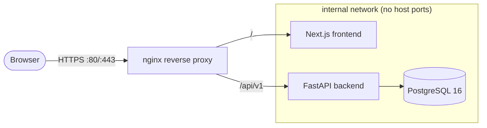

# Deployment

This guide covers running EOCC for evaluation, local development, and a hardened single-host production deployment, plus the path to scaling out. For the security rationale behind each control, see [SECURITY.md](../SECURITY.md); for the runtime design, see [ARCHITECTURE.md](../ARCHITECTURE.md).

## Topology

The bundled `docker-compose.yml` runs four services on an internal bridge network. **Only the reverse proxy publishes a host port** — the database, backend, and frontend are unreachable from outside the Docker network.



| Service | Image / build | Published | Notes |
| --- | --- | --- | --- |
| `proxy` | `nginx:1.27-alpine` | `${PROXY_PORT:-80}` | Only entry point. Routes `/` → frontend, `/api/v1` → backend. |
| `frontend` | `./frontend/Dockerfile` | — | Next.js standalone server. Read-only FS, `tmpfs:/tmp`. |
| `backend` | `./backend/Dockerfile` | — | FastAPI/Uvicorn. Read-only FS, `tmpfs:/tmp`. |
| `db` | `postgres:16-alpine` | — | Internal only. Persistent `eocc_pgdata` volume, healthcheck-gated. |

All services run with `no-new-privileges:true`; `backend` and `frontend` run with a read-only root filesystem.

## 1. Quick evaluation (Docker Compose)

```bash
git clone https://github.com/arydub-dev/EOCC.git
cd EOCC
cp .env.example .env
# Generate strong secrets (see "Secrets" below) and edit .env
docker compose up --build
```

Open `http://localhost`. With `SEED_ON_STARTUP=true`, the database is populated with demo data and demo accounts (see the README). Use the demo accounts to explore every module.

## 2. Local development (without Docker)

Run the two apps directly for hot reload. The backend defaults to SQLite, so no database server is required.

**Backend**

```bash
cd backend
python -m venv .venv && source .venv/bin/activate   # Python 3.12
pip install -r requirements.txt
export ENVIRONMENT=development
export DATABASE_URL=sqlite:///./eocc.db
uvicorn app.main:app --reload --port 8000
```

**Frontend**

```bash
cd frontend
npm install
echo "NEXT_PUBLIC_API_BASE_URL=http://localhost:8000/api/v1" > .env.local
npm run dev
```

Frontend: `http://localhost:3000` · API docs: `http://localhost:8000/docs`.

In `development`, the backend relaxes the production secret requirements and allows `COOKIE_SECURE=false` so cookies work over plain HTTP.

## 3. Production (single host)

1. **Provision** a host with Docker Engine + Compose plugin. Put it behind a TLS terminator (a managed load balancer, or add a TLS server block / Caddy in front of the proxy). Never expose the app over plain HTTP in production.
2. **Configure** `.env` from `.env.example`:
   - Set `ENVIRONMENT=production`.
   - Set strong `POSTGRES_PASSWORD`, `SECRET_KEY`, `REFRESH_TOKEN_SECRET`, and `ENCRYPTION_KEY` (see "Secrets").
   - Set `BACKEND_CORS_ORIGINS` to your exact site origin(s).
   - Keep `COOKIE_SECURE=true` and `RATE_LIMIT_ENABLED=true`.
   - Decide on seeding: set `SEED_ON_STARTUP=false` for a real deployment (the demo accounts and synthetic data are for evaluation only).
3. **Launch:** `docker compose up -d --build`.
4. **Verify:** `curl -f http://localhost/api/v1/../ready` (via the proxy) or hit `/ready` and `/health` on the backend; check `docker compose ps` shows all services healthy.

### Secrets

The backend refuses to start in `production` with default/weak secrets. Generate real values:

```bash
# SECRET_KEY and REFRESH_TOKEN_SECRET (JWT signing / refresh hashing)
openssl rand -hex 32

# ENCRYPTION_KEY (Fernet key for field-level encryption)
python -c "from cryptography.fernet import Fernet; print(Fernet.generate_key().decode())"

# Database password
openssl rand -base64 24
```

Store secrets in your platform's secret manager (Docker/Swarm secrets, Kubernetes Secrets, AWS Secrets Manager, GCP Secret Manager, Vault) and inject them as environment variables. Do **not** commit `.env`.

### Database lifecycle

- The reference build creates tables on startup via `create_all`. For production, adopt a migration tool (e.g. Alembic) so schema changes are versioned and reversible.
- Back up the `eocc_pgdata` volume regularly (`pg_dump`/snapshot). Test restores.
- Rotate `ENCRYPTION_KEY` with a re-encryption migration; rotating it without re-encrypting will invalidate stored connector secrets and MFA seeds.

## Configuration reference

Key environment variables (full list in [`.env.example`](../.env.example)):

| Variable | Default | Purpose |
| --- | --- | --- |
| `ENVIRONMENT` | `production` | `development` relaxes secret/cookie enforcement. |
| `DATABASE_URL` | — | SQLAlchemy URL; SQLite locally, PostgreSQL in prod. |
| `SECRET_KEY` | — (required) | Signs JWT access tokens. |
| `REFRESH_TOKEN_SECRET` | derived | Keyed hash for refresh tokens. |
| `ENCRYPTION_KEY` | — (required) | Fernet key for field encryption. |
| `ACCESS_TOKEN_EXPIRE_MINUTES` | `15` | Access-token lifetime. |
| `REFRESH_TOKEN_EXPIRE_DAYS` | `14` | Refresh-token lifetime. |
| `COOKIE_SECURE` / `COOKIE_SAMESITE` | `true` / `lax` | Auth cookie flags. |
| `BACKEND_CORS_ORIGINS` | `http://localhost` | Comma-separated allowed origins. |
| `RATE_LIMIT_*` | enabled | Request and auth rate limits. |
| `MAX_UPLOAD_BYTES` / `MAX_IMPORT_ROWS` | `10MB` / `50000` | Upload and import guards. |
| `SEED_ON_STARTUP` | `true` | Seed demo data on boot (disable in prod). |
| `OPENAI_API_KEY` / `OPENAI_MODEL` | blank / `gpt-4o-mini` | Optional AI copilot; blank uses the deterministic local engine. |

## Observability

- **Health/readiness:** `/live`, `/ready` (checks DB), `/health` (version + summary).
- **Metrics:** `/metrics` exposes Prometheus text metrics; scrape with Prometheus and visualize in Grafana.
- **Logs:** structured JSON logs carry `request_id` and `correlation_id`; ship them to your aggregator and pivot on those fields for tracing. Audit events are queryable via the Audit Center and `/api/v1/audit/export`.

## Scaling out

The single-host compose file is the starting point. To scale:

1. **Externalize state.** Move PostgreSQL to a managed, replicated instance with automated backups.
2. **Run stateless replicas.** The backend is stateless (sessions live in the DB), so run multiple backend and frontend replicas behind the load balancer.
3. **Replace in-memory rate limiting** with a shared store (e.g. Redis) so limits are consistent across replicas.
4. **Orchestrate.** Deploy to Kubernetes/ECS using the same images; the security posture (non-root, read-only FS, no-new-privileges, internal-only DB) maps directly to pod/security-context settings.

See [ROADMAP.md](../ROADMAP.md) for planned scaling and resilience work.
